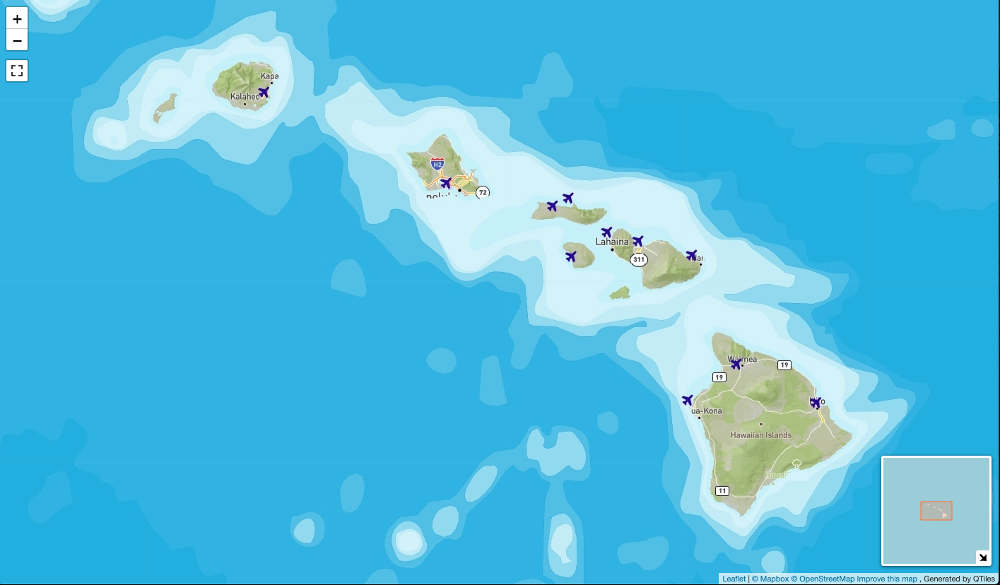
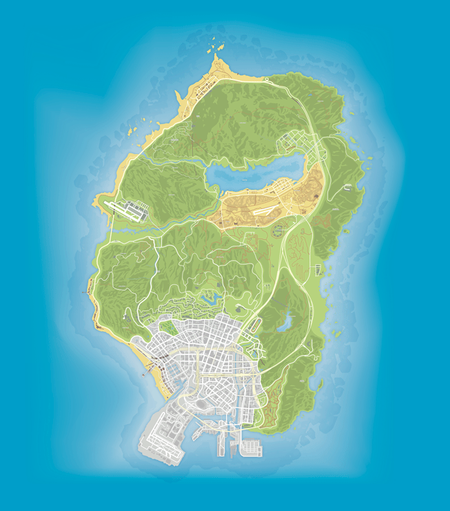

# Hawaii in GTA Style Web Map

This web map shows the map of Hawaii in the style (flavor) of the popular game GTA V. I got interested into web mapping because of the game and I thought it would be a cool homage to it if I can mimic the style. You can interact with it here: <https://kiku511.github.io/hawaii-gta-style/>

## Description

The map was created using [Mapbox Studio](https://studio.mapbox.com/), where I edited a lot of the elements to make sure it looks like the GTA V maps. A hard part was to create the water levels around the islands, so I used bathymetry data from [nvkelso/natural-earth-vector](https://github.com/nvkelso/natural-earth-vector) to make sure it looks like the GTA V map and is accurate. I used a few of the different water levels and included them as layers in the Mapbox studio. 

Then I added this map to QGIS and created tiles out of it using the QMetaTiles plug-in and then used leaflet to display it on the web. Additionally, I also used the full-screen and minimap plugins to make the map seem more interactive.

For this map, the default zoom level is 8, max zoom level is 12 and min zoom level is 4. I selected min level to be 4 so that we can see all the water depths around the islands of Hawaii (I wanted it to be even lower but that meant hours of tile calculation), max level to be 12 so that we can see the details of parks and roads like in the game map (I wanted this to be more as well but again, long processing times). Default level is set to 8 so that we can see all the islands in a single view. This means that the projection goes from 10,000 meters per pixel to as detailed as 38 meters per pixel. The projection used is pseudo-mercator.

### GTA V map

The game takes elements from Los Angeles to make a map of a city called Los Santos. It looks like this:

 

## Reference

[1] Bathymetry data from [nvkelso/natural-earth-vector](https://github.com/nvkelso/natural-earth-vector)

[2] US Airports from [catalog.data.gov](https://catalog.data.gov/dataset/usgs-small-scale-dataset-airports-of-the-united-states-201207-shapefile)

[3] Light base map from [OpenStreetMap](http://www.openstreetmap.org)

[4] Leaflet Full Screen Plugin from [Leaflet.fullscreen](https://github.com/Leaflet/Leaflet.fullscreen)

[5] Leaflet Mini Map Plugin from [Norkart](https://github.com/Norkart/Leaflet-MiniMap)

[6] GTA V map reference from [GTA-5-Map.com](https://gta-5-map.com/)

[7] QMetaTiles plug-in from [here](https://bitbucket.org/we-do-it/qgis-latlongo-stage-1)

[8] [Mapbox Studio](studio.mapbox.com)
